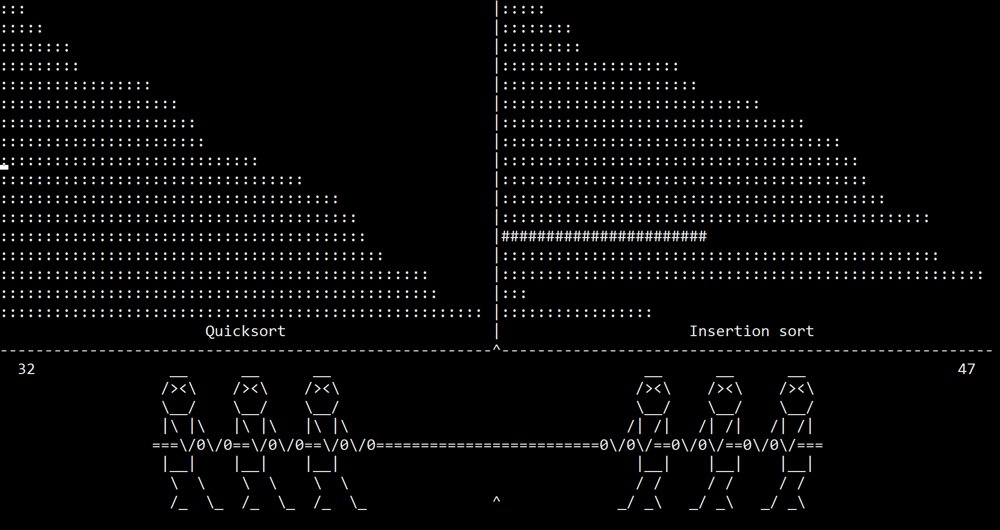
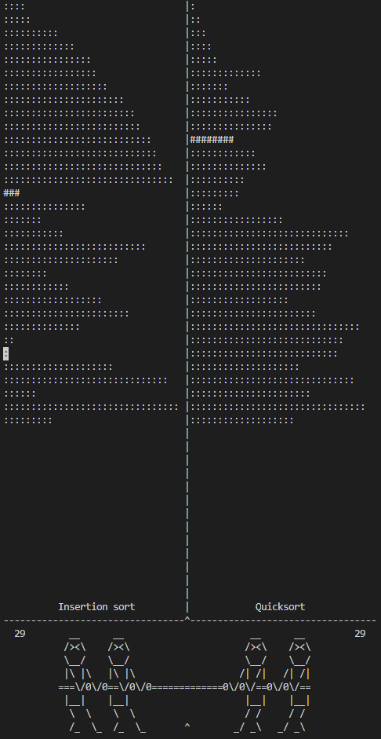

# Sort of War

## TL;DR

This is a small terminal program that does a basic step-by-step visualization of some sorting algorithms (currently Bubble sort, Insertion sort, Quick sort, and Selection sort). On top of this, they are shown as tug of war teams, where loser has to advance towards the middle.

## Details

## Screenshots

1. Horizontal terminal orientation

2. Vertical terminal orientation

## Requirements

- Python 3

## How to Run

In the root directory of the project:

`python start.py`